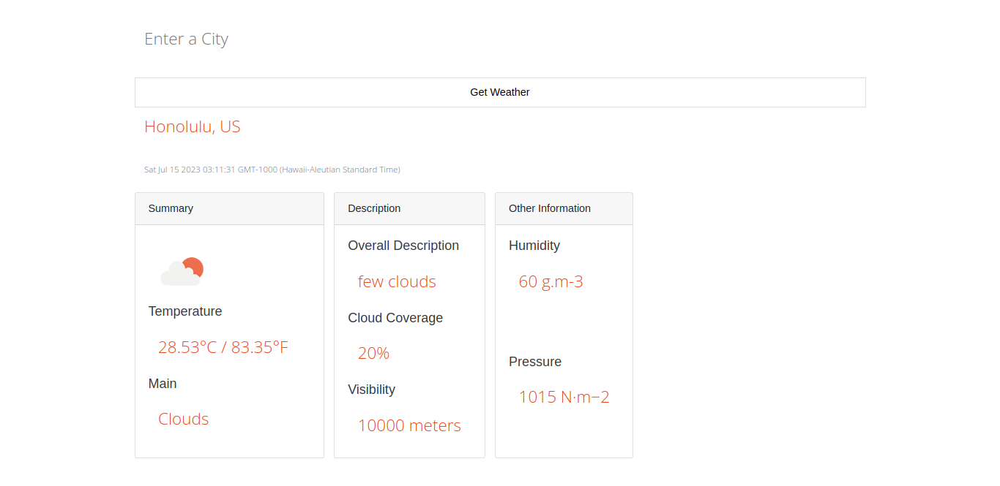

# weather-cli-app
A CLI application that uses Openweathermap API to display real-time weather forecasts.

Includes temperatures in Celsius and Fahrenheit, cloud coverage, visibility, humidity, and pressure.

